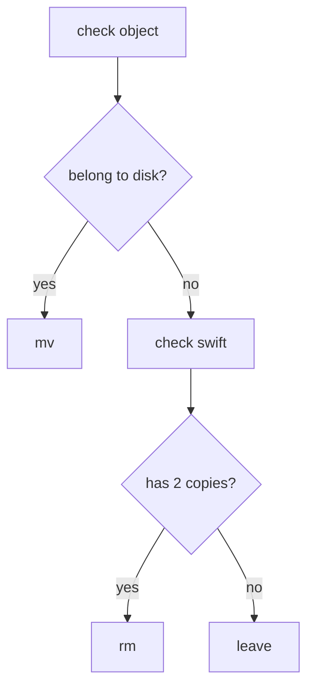

During the last 5 years in Nectar, I admit we've broken a number of things.
However, one of the most memorable incident in Nectar occurred just last week,
where we messed up our national swift cluster. Fortunately, we did not lose any
data (fingers crossed), and no one really noticed it.

# About the national swift cluster

Swift is the software that powers the object storage for Nectar. The backend
storage servers resides in different institutions all over Australia.
Configuration on these servers, as with all of our servers, are managed with
Puppet.

An object on the Swift cluster is 3x replicated and stored in 3 different
geographical locations. This protects against a local disaster at any
institution.

# How this happen?

We were doing a Swift upgrade when Puppet pushed out a bad version of Swift
config. This config, while not being immediately obvious was wrong, caused
the majority of the backend servers to think that the objects hosted on them
were misplaced.

In more detail, Swift uses a config value `swift_hash_path_suffix` to determine
placement of objects - i.e. when you put an object on the Swift cluster, which
(3x) backend servers should this object be written to. This config value has to
be the same across all API and storage nodes to ensure a consistent view of the
cluster.

Due to our changes, `swift_hash_path_suffix` was changed from a value enclosed
with quotes, to values without quotes on some storage nodes. Approximately 75%
of the storage nodes were affected. The API nodes were not affected.

# What happened then?

The servers, with the wrong config, now incorrectly decided that objects on them
were 'misplaced', and started moving them to the 'right' place in the cluster.
As part of this movement, the original objects were 'quarantined' - saved to a
location on the same disk so that recovery is possible.

As more and more objects were quarantined, disks started filling up. A few nodes
hit 100%, which meant no new data can be written to them. This is dangerous
because if too many disks are full, writes to the cluster can stop completely.

# Oh crap

Once the issue was identified, we quickly pushed out the correct version of the
config file. This halted the runaway process that was filling up our disks.
However, now we have a few big issues:

 - We have thousands, if not millions of objects quarantined and many disks
   were full.
 - Due to the objects being moved, many objects in our cluster now have less
   than 3 copies in the correct locations. If a disaster were to strike now, it
could wipe out the remaining copy of an object.
 - Service levels are being affected. E.g. if a user tries to write an object to
   the cluster, and all 3 destination disks are full, the write will fail.
 - We did not know if we lost data yet. This was the biggest issue on our minds.

# How we fixed it

We decided that we needed to work the problem from a few angles.

1. Our immediate priority was to free up some disk space so replication and
   writes can work. To do this, we need to clean up the quarantine objects.

1. To make sure data is safe, we need to check through all the objects. We need
   to figure out which ones now have 3, 2, 1, or 0 copies.

Our strategy was as follow:

## Free up space

1. Look at the quarantine objects. For each object, find out if they are
   supposed to be on this disk, or on some other disk in the cluster.

1. If the quarantine object is on this disk, move it out of quarantine, to the
   rightful location on the same disk. If there already is an object in that
location, delete the quarantine object to free up disk space. As the object (a
file) is on the same disk, this is a `mv` operation which is fast. (fast path)

1. If the quarantine object does not belong to this disk in the cluster, query
   swift.

1. If there are already 2 copies in swift, delete this object. We assume swift
   will replicate the third copy once there is enough disk space. (slow path)

### Detailed decision on freeing up space

To be perfectly safe, one should delete the quarantine object only if there are
3 copies. We chose to delete on 2 copies for a few reasons:

1. Many objects have < 3 copies because at least a copy have been quarantined.

1. The 'check and mv' (fast path) can quickly restore a copy on other disk.
   This script is running in parallel, one for each disk. At a point in time the
object might only have 2 copies (disk A and B), but once the script runs on disk
C, the quarantine object moves back to the rightful location. We wanted to
process all objects through the fast path as quick as possible to get the
maximum copies.

1. Freeing up space is the priority because we needed replication working.

1. We did not want to block writes.

## Check all objects

1. In parallel, we started checking all objects and notify if a 0 copy object is
   found.

1. For this object, look through all possible locations to find out if there is a
   copy in quarantine. If there is, restore that.

Once a copy is restored, the cluster can serve this object normally again.

# Lessons learnt

- Quotes matter in ini files, who knew?

- Swift is pretty damn resilient

- "*Most outages are caused by config changes*" - This has been repeated by many
  in the industry, and unfortunately Nectar has contributed to the statistics.
One needs to be careful doing any sort of config change, no matter how trivial
it seems. Bringing up a new service is much simpler in comparison.

# Thanks

Many thanks to fellow operators from the different sites pulling together to fix
this issue - Matt and Karl from UTas, Glenn from Intersect, Swe from Monash.
Also thanks to my fellow Core Services Operators for hacking up scripts on the
go and using Slack as a DVCS.

Cheers to Swift and OpenStack for building a damn fine product. In a commercial
closed sourced product we will probably be up shit creek and waiting for a
vendor to fly in. The nature of open source let us inspect everything that Swift
is doing and hack up a fix in a few hours.
